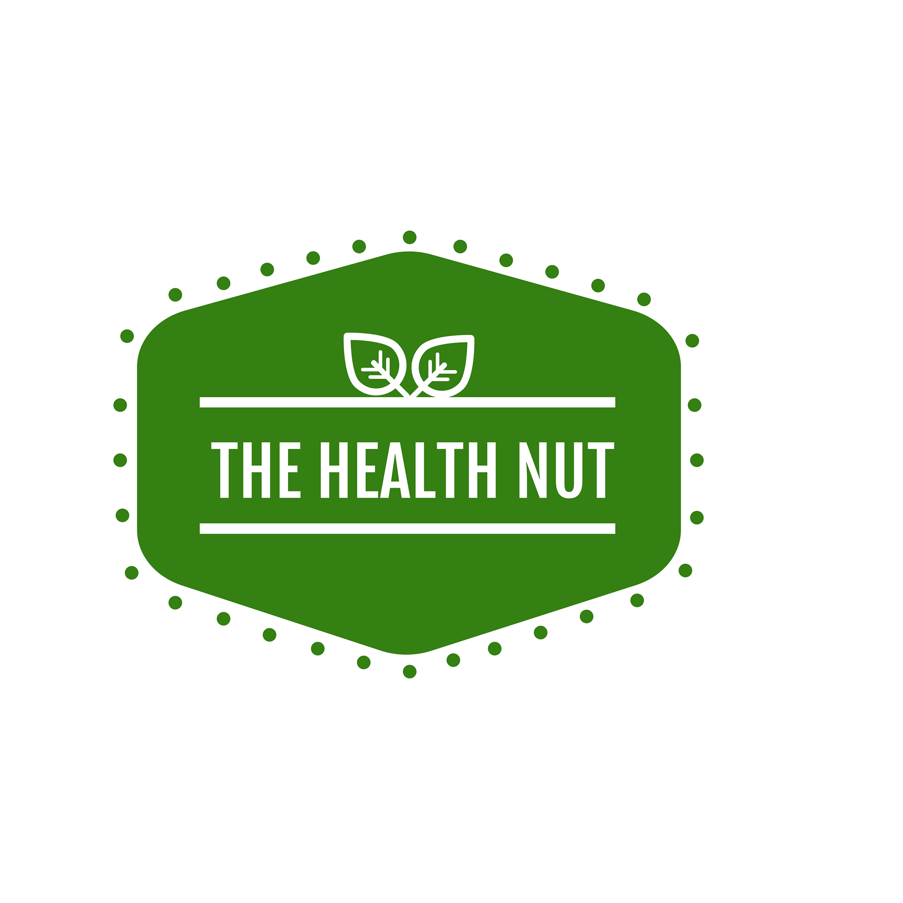

## Healthnut app 

  - The purpose of 'HealthNut' is to provide everyday grocery shoppers quick access and easy-to-read information to over 100,000 food products.
----------------------------------------------------

* What goal will your website be designed to achieve?
The main goal of the website is to help deliver a recipe based on the available food items a given user has in their household. The application is designed to give users a suggestion based on food items, favorite foods, cuisine types and dish types. 
 
2. What kind of users will visit your site? In other words, what is the demographic of your users? 
There is no age restriction for using this application. Anyone at any age can cook. Therefore users of any age can use this app to locate a recipe. It is user friendly in the way that it supports recipes for any available food item.  

3. What data do you plan on using? You may have not picked your actual API yet, which is fine, just outline what kind of data you would like it to contain. 
I am using the Spoonacular API to retrieve information on recipes and display the output to the user. The API can be found using the following link: https://spoonacular.com/food-api/.

----------------------------------------------------

### App Features
  - Create an account
  - Edit user profile
  - Modify password
  - Login/Logout
  - Search recipes using 3 ingredients or less
  - Save searched recipes 
  - Create a new recipe
  - Edit or delete recipes

----------------------------------------------------

### In this Capstone I used technologies such as:
  - Python
  - Flask
  - SQL-Alchemy
  - Werkzeug
  - WTForms
  - Pillow
  - Heroku
  - gunicorn
  - bcrypt
  - Jinja2

----------------------------------------------------

### Spoonacular API 
- Accessible here: https://spoonacular.com/food-api

